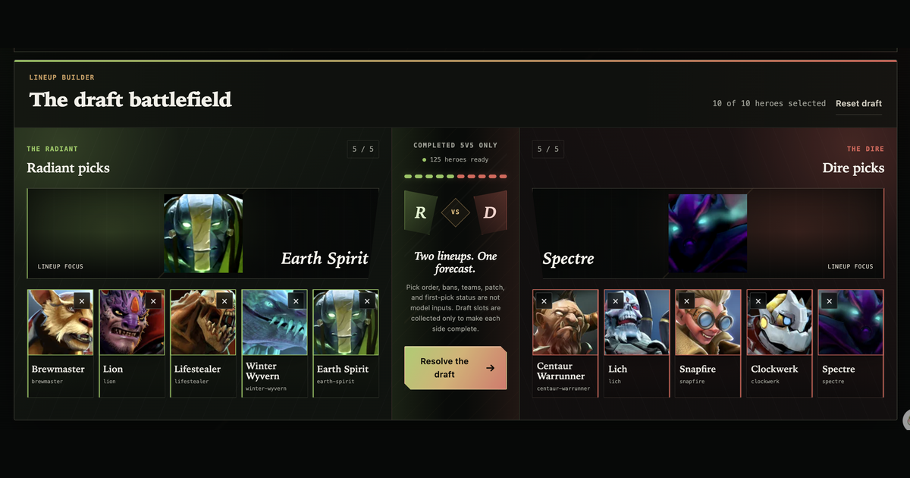
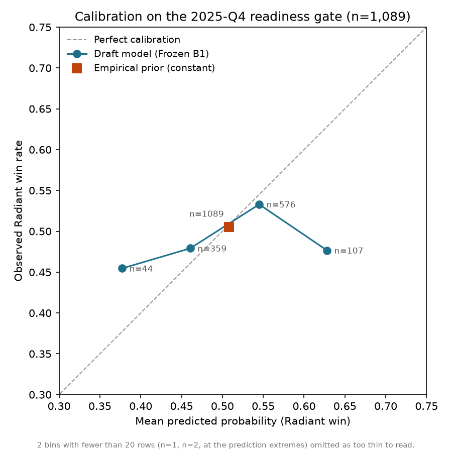
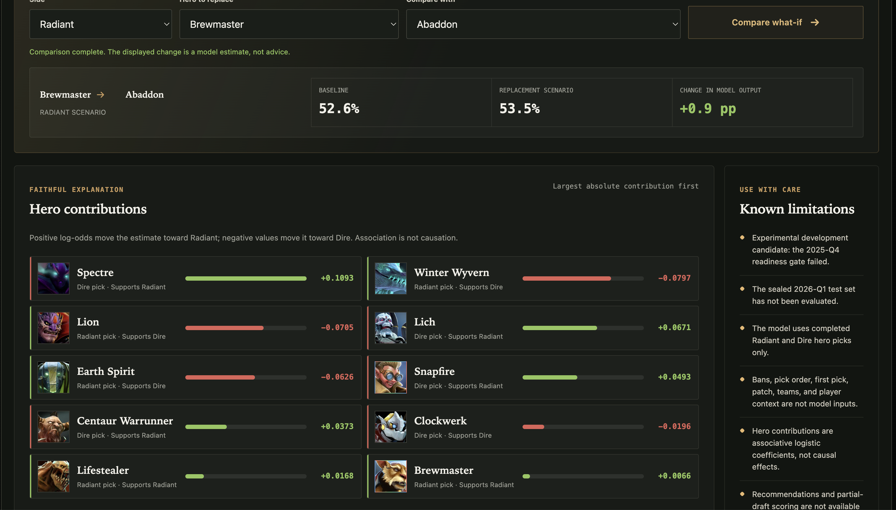

# Dota 2 Draft AI

**How much of a professional Dota 2 match is decided by the draft?**

Less than this model could detect — and that non-result is what the product
publishes. A leakage-controlled model trained on 20,087 professional games
fails to beat a constant prior on held-out data. Draft Lab ships labelled as
an experimental candidate that did not pass its readiness gate.

[**Open Draft Lab →**](https://dota2-draft-lab.jbaptiste-q.workers.dev)



---

## Three findings

### 1. Draft-only win prediction sits at the noise floor

Fit on 20,087 games before 2025-10-01, evaluated on the reserved 2025-Q4 window:

| 2025-Q4     | Draft model | Empirical prior | Better |
| ----------- | ----------- | ---------------- | ------ |
| Log loss    | 0.69825     | 0.69312          | prior  |
| Brier score | 0.25245     | 0.24998          | prior  |



The candidate was not promoted and the sealed 2026-Q1 test was never opened.

Under this dataset, feature contract, and temporal evaluation design, the
draft-only signal was too weak and unstable to support deployment — not a
proven ceiling on draft prediction in general. The instability replicates
across model families: both the linear candidate and a pre-registered GBDT
baseline beat the prior on pooled development folds (2025-Q1–Q3) and lost to
it on Q4. The likely reason: between
elite teams, both sides draft competently by definition, so hero composition
carries little of the outcome signal — team strength does, and team identity
is deliberately excluded from the feature set.

### 2. Hero embeddings collapse to zero — forced open, they show no role structure

A low-rank interaction model — one embedding vector per hero, pairwise dot
products as within-side synergy and cross-side counters — was pre-registered as
nine candidates (`embedding_dim ∈ {4, 8, 16} × L2 ∈ {0.01, 0.1, 1.0}`). None
qualified: every candidate's embeddings converged to within `5.6e-5` of zero,
and the best of the nine failed the gate against the frozen draft-only
candidate — +0.000397 log loss, 95% CI `[-0.001164, +0.001880]`, an interval
that spans zero. The gate required a significant improvement; this wasn't
one. `v = 0` is a stationary point of the interaction gradient at every
pre-registered penalty; the signal only escapes zero roughly 3x below the
weakest setting tested.


A descriptive-only refit at that escape point (never gated, never promoted)
produces this 2D projection. Role clusters do not emerge: 123 of 125 heroes
sit at embedding norm under 0.2, and the two that don't — Tiny (0.297) and
Pangolier (0.263) — have nearest neighbours with nothing in common
functionally. They're also the corpus's two most-picked heroes (5,736 and
4,655 picks against a median of 1,662) — the residual signal that survives
regularization concentrates on training exposure, not on functionally
distinct roles. It reads less like emergent structure and more like a
frequency artifact. Full neighbour and synergy/counter-pair detail is in the
[M8 milestone report](docs/milestones/MILESTONE_8_HERO_EMBEDDINGS.md).

### 3. A model ranking can be an artifact of where you draw a category line

This pipeline was built as a prerequisite for patch-aware modeling features —
matching hero changes to shifts in pick rates. It stopped at labelling: the
labels never fed back into the draft-only model, and what this milestone
actually produced is the evaluation methodology below, not a model feature.

10,713 hero changes were extracted from official patch notes and labelled by an
LLM. Before the full pass, three candidate models were compared against 120
hand-annotated examples, with model outputs withheld until annotation was
complete.

Two things came out of it.

**The magnitude dimension was dropped.** All three models scored 22.5–29.2%
against a 72.5% majority-class baseline, with Cohen's κ indistinguishable from
zero. The annotation guide gave concrete rules for direction but no anchoring
for minor versus major, so the annotator's scale and the models' scales never
aligned. The label was removed rather than repaired.

**The ranking reversed when one category definition was tightened.** The
`rework` category was initially applied without an operational rule. After
adopting an explicit one — retain `rework` only where the change alters *how*
an ability works, not where it can be described as the same mechanic being
stronger or weaker — 22 of 29 labels moved.

| Direction accuracy | Broad definition | Narrow definition |
| ------------------- | ------------------ | -------------------- |
| Haiku 4.5           | 0.658               | 0.658                 |
| Sonnet 5             | 0.617               | 0.667                 |
| Fable 5              | **0.700**           | 0.633                 |

Model predictions were frozen across both passes. The best model became the
worst without a single prediction changing. What looked like a capability
difference was a moving measurement.

Neither ranking is significant at n=120 — McNemar p=0.267 and p=0.508, with the
bootstrap interval spanning zero in both directions. Haiku was chosen for the
full pass on determinism and cost instead: it is the only one of the three that
accepts `temperature=0` at all, since Sonnet 5 and Fable 5 reject non-default
sampling parameters outright.

Full pass: 10,708 of 10,713 changes labelled (99.95%), five permanent parse
failures traced to a reproducible formatting quirk rather than transient error.

Full evaluation: [M9 patch alignment](docs/milestones/MILESTONE_9_PATCH_ALIGNMENT.md)

---

## What Draft Lab does

Assemble a completed 5v5 draft and the service returns complementary Radiant and
Dire probabilities, the exact signed log-odds contribution of all ten heroes, and
a comparison against one user-chosen hero replacement. Every response carries the
model cutoff, its lineage, and its failed readiness gate.

It does not rank heroes, suggest a next pick, read partial drafts, or claim
causation. Bans, draft order, roles, lanes, patch, team, and player context are
all outside v1.



---

## Method

**Leakage control.** Grouped chronological splits by `source_match_id`,
transformers refit inside each fold, forbidden columns enforced in code, and a
locked test window that has never been opened. A sealed-window boundary rule is
enforced at the repository level; two violations were caught, recorded, and are
documented in `docs/incidents/`.

**Why not deep learning — and what a GBDT actually found.** 23k games and 125
heroes is far too little for a transformer to beat a regularized linear
model, and the linear form is what makes Draft Lab's per-hero contribution
breakdown exact rather than approximate. Gradient boosting was measured
rather than argued away: a pre-registered LightGBM baseline, selected on
development folds without touching Q4, landed within a half-thousandth of
the frozen linear candidate's log loss on the readiness window (−0.000541,
95% CI `[−0.005983, +0.004677]`) and failed the same gate against the prior.
Tree capacity recovered nothing beyond additive hero effects — an
independent replication, in a second model family, of Finding 2's collapsed
interaction signal. Gradients for the project's own models remain
hand-derived in numpy; there is no deep-learning framework in the dependency
tree. Full grid, gate, and artifact detail: [M10 milestone
report](docs/milestones/MILESTONE_10_GBDT_BASELINE.md).

**Reproducibility.** Immutable raw cache, SHA-256 fingerprints chaining raw →
normalized → supervised → model, content-addressed build directories, and an
offline test suite that blocks sockets and DNS.

---

## Data

23,123 eligible professional games across 11,664 matches, 2022-Q1 through
2026-Q1, from the official Liquipedia API — no HTML scraping, rate-limited
acquisition, immutable caching, and a request ledger.

Match data © Liquipedia and its contributors, licensed under [CC-BY-SA
3.0](https://liquipedia.net/commons/Liquipedia:Copyrights), obtained via the
official Liquipedia API.

Patch notes come from Valve's `datafeed/patchnotes` endpoint. Raw text is never
committed; only derived labels are.

See [Data Boundaries](data/README.md) for the exact public/local split.

---

## Run locally

Python 3.12.

```bash
python3 -m venv .venv
source .venv/bin/activate
python -m pip install -r requirements.txt
python scripts/run_draft_assistant.py   # http://127.0.0.1:8000
```

Full offline validation:

```bash
env LIQUIPEDIA_API_KEY= NO_NETWORK_TESTS=1 python -m pytest -q
python scripts/check_repository_hygiene.py
```

---

## Repository map

| Path                          | Responsibility                                            |
| ----------------------------- | ----------------------------------------------------------- |
| `src/liquipedia_backfill/`    | Guarded acquisition, cache, ledger, coverage              |
| `src/liquipedia_pipeline/`    | Typed parsing, normalization, Parquet export              |
| `src/draft_training_dataset/` | Canonical supervised-dataset contract                     |
| `src/draft_ai_modeling/`      | Temporal splits, experiments, gates, lineage              |
| `src/draft_ai_assistant/`     | Frozen contracts, inference service, FastAPI, Draft Lab   |
| `src/patch_alignment/`        | Patch-note acquisition and LLM labelling                  |
| `docs/`                       | Engineering log — see the index, not written to be read straight through |

---

## Scope and limitations

The model is an experimental candidate that failed its readiness gate. It is not
a forecasting, betting, or coaching service. Replacement comparisons are
associative, not causal.

Patch alignment covers only versions observed in the working corpus. Patches
7.40 and later have 31 games or fewer outside the sealed window and are excluded
on sample-size grounds — the data exists but is not readable under the sealed
window policy.

Two heroes are unmapped in the patch-note join: one placeholder entry in Valve's
feed that is not a real hero, and Largo, which debuted nine days before the
sealed window opened and therefore has effectively no readable match data.

---

## How this was built

Implementation was done with Claude Code; I designed the experiments and
constraints, reviewed the generated code, and made every promotion decision —
including the ones that killed a candidate.
