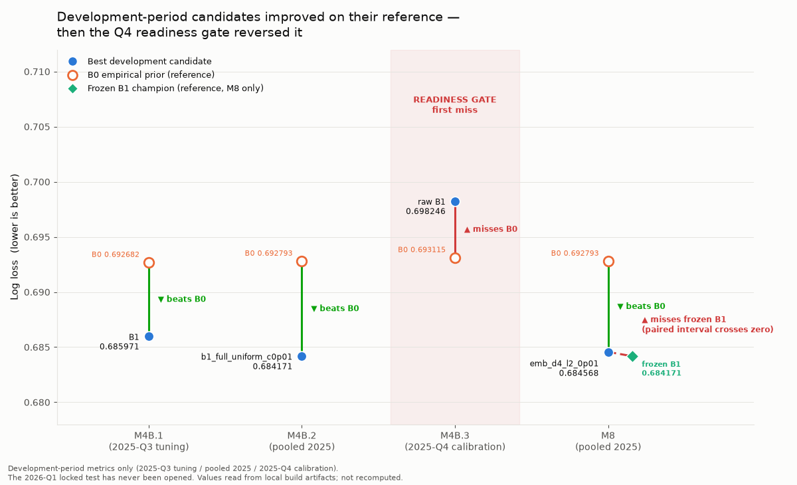
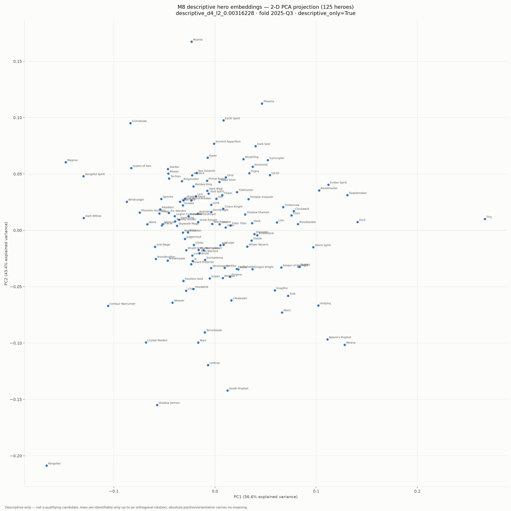

# Dota 2 Draft Analysis

Can a professional Dota 2 draft predict who wins? Four pre-registered
experiments on 23,123 tier-1/tier-2 games say no — and this repository
documents exactly why.

[]()
[]()
[]()

**[Live demo →](YOUR_URL_HERE)**

---

## The question

In professional Dota 2, both teams draft ten heroes before the game starts.
The draft is widely believed to decide a large share of the outcome — hero
synergies, counters, and composition are the entire subject of professional
analysis.

That belief is testable. If draft composition carries predictive signal, a
model given only the ten picks should beat a model given nothing at all.

It doesn't.

## The answer



Three of four modeling attempts improved on their empirical-prior reference
during development. None survived the final readiness gate on a period that
had never influenced any modeling decision.

*The y-axis is zoomed: the total spread is roughly 2% in log loss. That
small scale is itself part of the finding.*

## What I found

**1. Pick presence carries real but unstable signal.**
A logistic regression on side-relative hero presence beat the empirical prior
on tuning data (0.685971 vs 0.692682 log loss), but regressed in all four 2024
rolling folds. The signal existed; it did not generalize across time.

**2. Stronger regularization fixed the instability, not the ceiling.**
Shrinking to `C=0.01` beat the prior in six of seven quarters and resolved the
temporal instability — without discarding old matches. Full history under
strong shrinkage outperformed both exponential decay and a hard one-year
window. The problem had been coefficient variance, not the age of the data.

**3. Calibration cannot recover ranking signal that isn't there.**
On the reserved 2025-Q4 period, the frozen candidate scored 0.698246 against
the prior's 0.693115. Sigmoid and isotonic calibration were both tested; raw
probability was selected, and all three remained worse than the prior.
This is the pivot: development gains did not survive an evaluation period
that had never been used for selection.

**4. Hero interactions collapse to zero under any regularization strong
enough to generalize.**
I fit a low-rank interaction model — an embedding per hero, synergy as
within-side dot products, counters as cross-side. Across all nine
pre-registered candidates the embeddings converged to *exactly* zero.



This is not premature stopping: `v = 0` is a stationary point of the
interaction gradient, and remains optimal whenever the interaction curvature
is weaker than the penalty. Verified at 20,000 iterations with 1e-9 tolerance.
Sweeping the penalty downward, embeddings first escape zero between
`L2 = 0.01` and `L2 ≈ 0.00316` — half an order of magnitude below the weakest
pre-registered setting.

Forcing the embeddings to survive produces no role structure. The great
majority of the 125 heroes sit within a tight radius, with only two exceeding
0.2 (Tiny at 0.297, Pangolier at 0.263), and those outliers share no
functional property. The interaction signal is real but weaker than the
regularization needed to generalize at this sample size.

## Why this is the interesting answer

The 2026-Q1 test period has never been opened. Not once, across four
milestones — no transforms, no predictions, no target reads. Opening it would
have spent a single-use evaluation on a candidate that had already failed the
development gate.

Every experiment was pre-registered before fitting: the candidate matrix,
the folds, the metrics, and the qualification rules. No model was promoted
after failing its gate, and no gate was revised after seeing results.

The honest conclusion is narrower and more useful than a headline accuracy
number would have been:

> At 23,123 professional games with hero identity alone, the learnable signal
> in draft composition is weaker than the estimation noise. This is a limit of
> the data's information content, not of model capacity.

## Data

23,123 games from 11,664 professional series, tier 1 and tier 2, spanning
`[2022-01-01, 2026-04-01)`. Sourced from the official Liquipedia API with a
full provenance chain: immutable byte-level cache, SHA-256 request ledger, and
content-addressed builds from raw response through normalized tables to the
supervised dataset.

2026-Q2 acquisition was deliberately stopped. A partial quarter introduces
selection bias, and completing it would not change the conclusion — the
bottleneck is what the data contains, not how much of it there is.

Liquipedia's match API exposes picks, bans, sides, and outcomes. It does not
expose draft order, hero roles, positions, lanes, or itemization. That
absence is the most likely explanation for finding (4), and the natural next
direction for this work.

[Data architecture and field contract →](docs/)

## Method

- Grouped chronological splits; every game from one series stays in one role
- Feature transformers refit on past-only rows within each fold
- 1,000 paired bootstrap replicates grouped by series for all comparisons
- Pre-registered candidate matrices and qualification gates
- Forbidden-column enforcement: no post-game information reaches any feature
- Full offline test suite; no network access during any experiment

**Why no deep learning.** At 23k rows over 125 heroes, the binding constraint
is estimation variance, not model capacity. A higher-capacity model would fit
the training window better and generalize worse — which is precisely what the
slot-aware 3,024-column baseline demonstrated. The low-rank interaction model
in finding (4) is the appropriate way to add interaction capacity at this
sample size, and it still collapsed.

## Run it

```bash
pip install -r requirements.txt

# Reproduce the modeling pipeline offline
env LIQUIPEDIA_API_KEY= NO_NETWORK_TESTS=1 python -m pytest -q

python scripts/prepare_draft_modeling.py
python scripts/run_draft_baselines.py
python scripts/run_draft_embeddings.py
```

All experiments run offline against local build artifacts. No API key is read.

## Engineering log

Milestone reports documenting acquisition, normalization, dataset
construction, and each modeling stage are under [`docs/milestones/`](docs/milestones/).
They are a contemporaneous record of decisions, including the ones that
turned out to be wrong.
