# Dota 2 Draft AI

An end-to-end Applied AI portfolio product built from professional Dota 2
matches obtained through the official Liquipedia API.

Draft Lab lets a user assemble a completed 5v5 draft, inspect the model's
Radiant and Dire win-probability estimates, trace every hero's exact additive
contribution, and compare one user-selected hero replacement. The current
model is published as an **experimental development candidate**, with its
failed readiness result shown directly in the product.


## Try the product

| Experience | Location |
| --- | --- |
| Public Draft Lab | **Pending M6 deployment — URL will be recorded after verification** |
| Local application | `python scripts/run_draft_assistant.py` |
| Local OpenAPI documentation | `http://127.0.0.1:8000/docs` |

The one-click **Try example draft** control produces a real response from the
same inference service used for manually assembled drafts. It is not a mocked
demo and requires no API credential, training dataset, or live Liquipedia
connection.

## What the product does

- Validates exactly five unique supported Radiant picks and five unique
  supported Dire picks.
- Returns complementary Radiant and Dire model-estimated probabilities.
- Explains the result with all ten exact signed hero log-odds contributions.
- Compares an original completed draft with one completed draft after the user
  chooses both the outgoing and incoming hero.
- Publishes the model cutoff, lineage, failed 2025-Q4 readiness gate, and
  unevaluated 2026-Q1 locked-test status before the result is trusted.

Draft Assistant v1 does **not** rank heroes, recommend a next pick, analyze
partial drafts, or claim causal effects. It does not model bans, draft order,
first pick, roles, lanes, synergy, counters, patch, team, player, or tournament
context. These are frozen product boundaries, not hidden future capabilities.

## Product walkthrough

1. Select **Try example draft**, or choose ten heroes manually.
2. Select **Analyze completed draft** to see the probability, exact
   contributions, model evidence, and limitations.
3. In **What-if replacement**, choose one selected hero and one unselected
   supported hero. Draft Lab runs the same analyzer on both completed drafts
   and reports the change in model output.

The replacement result is explicitly marked
`associative_model_comparison_not_causal` and `recommendation: false`.

## As-built architecture

```mermaid
flowchart LR
    LP["Official Liquipedia API"] -->|"guarded offline acquisition"| RAW["Immutable local responses<br/>request ledger + provenance"]
    RAW --> NORM["Typed parsing and normalization<br/>versioned relational Parquet"]
    NORM --> SUP["Canonical supervised dataset<br/>dota-draft-supervised-v1"]
    SUP --> EXP["Closed temporal modeling experiments<br/>leakage-safe evaluation"]
    EXP --> SNAP["Reviewed JSON inference snapshot<br/>coefficients + lineage + model evidence"]
    SNAP --> SERVICE["Framework-independent<br/>DraftAssistantService"]
    SERVICE --> API["Canonical FastAPI adapter<br/>local + contract reference"]
    API --> PARITY["Cross-runtime golden parity tests"]
    SNAP --> WORKER["Deployment Worker<br/>same frozen contracts"]
    PARITY --> WORKER
    WORKER --> WEB["Interactive Draft Lab"]
```



The runtime boundary begins at the tracked JSON snapshot. The deployed product
does not read the Liquipedia credential, call Liquipedia, load authenticated
responses, access ignored training data, or deserialize an executable model
binary.

## Evidence, not just a demo

The working corpus contains **23,123 eligible professional games** grouped into
**11,664 matches**, with contiguous validated coverage from 2022-Q1 through
2026-Q1. The frozen model was fit on 20,087 games before
`2025-10-01T00:00:00Z`.

The candidate did not beat the empirical-prior reference on the 2025-Q4
readiness period:

| 2025-Q4 metric | Draft candidate | Empirical prior | Better |
| --- | ---: | ---: | --- |
| Log loss | 0.69825 | 0.69311 | Empirical prior |
| Brier score | 0.25245 | 0.24998 | Empirical prior |

Lower is better for both metrics. The candidate was therefore not promoted and
the sealed 2026-Q1 evaluation was not opened. The portfolio deployment is a
transparent engineering demonstration, not a production-quality forecasting,
betting, coaching, or recommendation service.

## Why this is an Applied AI engineering project

- **Official-data integration:** guarded, rate-safe acquisition with immutable
  caching, checkpoints, request accounting, and no HTML scraping.
- **Reproducible data contracts:** raw responses, typed normalization,
  versioned Parquet, a canonical supervised schema, fingerprints, and lineage.
- **Leakage-aware modeling:** grouped temporal evaluation, train-only feature
  fitting, locked periods, fixed readiness gates, and documented negative
  results.
- **Faithful inference:** the product snapshot reproduces the selected
  estimator with deterministic prediction identities and exact explanation
  reconstruction.
- **Product delivery:** strict Pydantic contracts, framework-independent
  service logic, FastAPI reference endpoints, a parity-tested deployment
  adapter, an accessible browser workflow, offline tests, and repository
  hygiene safeguards.

## Run locally

Python 3.12 is the validated runtime.

```bash
python3 -m venv .venv
source .venv/bin/activate
python -m pip install -r requirements.txt
python scripts/run_draft_assistant.py
```

Open `http://127.0.0.1:8000`.

Run the complete active offline validation suite:

```bash
env LIQUIPEDIA_API_KEY= NO_NETWORK_TESTS=1 python -m pytest -q
python -m compileall -q src scripts tests
python -m pip check
python scripts/check_repository_hygiene.py
node --check src/draft_ai_assistant/web/app.js
cd site
npm ci
npm test
```

Tests block outbound sockets and DNS resolution. They neither require nor read
Liquipedia credentials.

## Repository map

| Path | Responsibility |
| --- | --- |
| `src/liquipedia_pipeline/` | Typed parsing, deterministic normalization, quality observations, and Parquet export |
| `src/liquipedia_backfill/` | Request planning, guarded acquisition, cache, checkpoints, ledger, deduplication, coverage, and publication |
| `src/draft_training_dataset/` | Independent canonical supervised-dataset contract and builder |
| `src/draft_ai_modeling/` | Temporal splits, feature transforms, fixed experiments, evaluation gates, and artifact lineage |
| `src/draft_ai_assistant/` | Frozen product contracts, JSON snapshot, inference service, FastAPI adapter, and Draft Lab |
| `site/` | Public portfolio deployment package |
| `tests/` | Active offline contract, lineage, service, API, frontend, and no-network tests |
| `archive/kaggle_baseline/` | Preserved historical experiment; excluded from the official pipeline and active CI |

## Data and security boundary

The repository versions credential-free request plans, fingerprints, compact
coverage summaries, schemas, source code, tests, and the reviewed 22 KB
inference snapshot. API keys, authenticated responses, raw caches, SQLite
state, checkpoints, generated datasets, model binaries, and local environments
remain ignored.

See [Data Boundaries](data/README.md) for the exact public/local split and the
[validated field contract](docs/MILESTONE_1_LIQUIPEDIA_FIELD_CONTRACT.md) for
which official draft fields are available and unavailable.

## Release roadmap

| Milestone | Status | Outcome |
| --- | --- | --- |
| M5.3 — Product Contract Freeze | **Complete** | Completed-draft probability, exact explanations, and user-directed replacement comparison are the frozen v1 scope. |
| M6 — Production Release and Deployment | **In progress** | Deploy and verify the frozen experimental product without changing its model or claims. |
| M7 — Portfolio Release and Final Acceptance | **Pending M6** | Publish the reviewed release identity, live walkthrough, acceptance evidence, and final repository narrative. |

Modeling research is closed. A context-sensitive recommendation engine is
optional, outside v1, and will not be added without explicit approval.

## Selected documentation

- [Product contract freeze](docs/milestones/MILESTONE_5_3_PRODUCT_CONTRACT_FREEZE.md)
- [Draft Assistant vertical slice](docs/milestones/MILESTONE_5_DRAFT_ASSISTANT_VERTICAL_SLICE.md)
- [Completed-draft replacement explorer](docs/milestones/MILESTONE_5_2_COMPLETED_DRAFT_REPLACEMENT_EXPLORER.md)
- [Modeling infrastructure](docs/milestones/MILESTONE_4A_MODELING_INFRASTRUCTURE.md)
- [Historical data publication](docs/milestones/MILESTONE_3_5_BOUNDED_HISTORICAL_DATASET_PUBLICATION.md)
- [Product and data architecture](docs/MILESTONE_1_PRODUCT_DATA_ARCHITECTURE.md)
- [M6 production deployment record](docs/milestones/MILESTONE_6_PRODUCTION_DEPLOYMENT.md)
- [M7 portfolio release record](docs/milestones/MILESTONE_7_PORTFOLIO_RELEASE.md)

Historical milestone reports preserve the decision context that existed when
they were written. This README and the M5.3 contract define the active product
scope.

## License

No open-source license is currently granted. Unless a later license file states
otherwise, all rights are reserved by the repository owner. Public visibility
does not grant permission to copy, modify, or redistribute this work.
