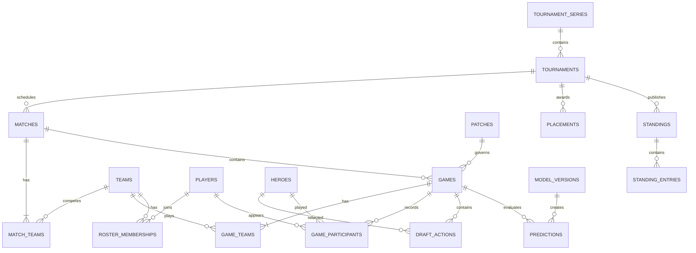
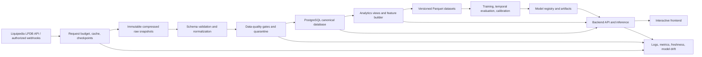

# Dota 2 AI Analytics Platform

## Milestone 1: Product, Data, and System Architecture

**Status:** Architecture proposal
**Date:** July 27, 2026
**Data-source policy:** Official Liquipedia APIs and documentation only. No scraping.

Milestone 1 is complete as an architecture proposal. No application code is included in this milestone.

The key finding is that the platform is feasible, but the AI Draft Assistant and detailed Player Analytics remain conditional on what Liquipedia exposes through the authenticated LiquipediaDB (LPDB) OpenAPI schema. Liquipedia demonstrably stores ordered drafts and rich game statistics, but its public documentation does not prove that every Dota-specific field is available through the external API.

## 1. Product Definition

The product should be positioned as an AI-assisted professional Dota 2 analysis platform—not a Liquipedia replica and not a betting product.

### 1.1 Primary Users

- Dota 2 fans who want to understand drafts.
- Analysts and content creators exploring team, player, patch, and tournament trends.
- Developers and ML practitioners interested in an explainable esports prediction system.

### 1.2 Flagship Experience: AI Draft Assistant

Given an incomplete or complete professional draft, the system should return:

- Radiant and Dire win probabilities.
- A calibrated confidence or uncertainty indicator.
- The main factors influencing the prediction:
  - Hero synergies.
  - Hero counters.
  - Side and first-pick effects.
  - Patch context.
  - Team and roster form, when enabled.
- How the probability changed after each draft action.
- Supporting sample sizes and warnings for uncommon combinations.

Potential later enhancement:

- Evaluate every legal remaining hero as a counterfactual next pick.
- Rank candidates by predicted probability change.
- Explain trade-offs instead of presenting a single “correct” pick.

This must remain analytical and educational. It should never expose betting odds, gambling recommendations, or imply causality. Liquipedia explicitly excludes betting-related projects from free access and does not permit projects that merely reproduce Liquipedia’s existing experience. The AI interpretation is therefore both the differentiator and an important compliance boundary. See the [Liquipedia API overview](https://liquipedia.net/api).

### 1.3 Supporting Experiences

#### Player Analytics

- Recent form and career record.
- Hero pool and hero-specific performance.
- Performance by patch, team, tournament tier, and opponent.
- KDA, damage, farm, net worth, and GPM when externally available.
- Roster and transfer history.

#### Match Analytics

- Series and individual-game results.
- Draft timeline and probability evolution.
- Team and player performance.
- Similar historical drafts.
- Pre-match versus post-draft probability comparison.

#### Patch Analysis

- Hero pick, ban, contest, and win rates.
- Side and first-pick balance.
- Draft diversity.
- Changes in team and hero strategies between patches.

#### Tournament Analysis

- Results, placements, standings, and format.
- Draft meta and hero diversity.
- Team trajectories and head-to-head records.
- Patch composition and regional differences.

#### Visualizations

- Hero synergy matrices.
- Hero counter matrices.
- Pick/ban co-occurrence heatmaps.
- Draft timelines and probability waterfalls.
- Patch comparison charts.

Spatial map heatmaps—wards, movement, deaths, or farming locations—should not be promised. They require positional telemetry or replay data not present in the currently documented LPDB match schema.

## 2. Initial Product Boundaries

The recommended initial scope is:

- Professional tournament matches only.
- Dota 2 only.
- English interface initially.
- Historical and interactive draft analysis, not live betting or odds.
- Only Liquipedia APIs; no OpenDota, Stratz, Dotabuff, Valve API, or HTML scraping.
- No user accounts in the first product version.
- Model predictions are informational and always show model version, data freshness, and uncertainty.
- Raw API datasets and credentials are never committed to the public repository.

## 3. Liquipedia Resource Map

Liquipedia publicly identifies ten LPDB resource types:

1. Broadcasters
2. External Media Links
3. Matches
4. Placements
5. Players
6. Series
7. Standings
8. Teams
9. Tournaments
10. Transfers

The public API page states that the authenticated API is documented using OpenAPI 3 and supports webhooks. See the [Liquipedia API overview](https://liquipedia.net/api).

The table below uses those logical resource names rather than assuming literal URL paths. Routes, pagination, query syntax, and Dota-specific `extradata` fields must come from the authenticated OpenAPI specification.

| Feature | LPDB resources | Required data | Assessment |
| --- | --- | --- | --- |
| Draft Assistant | Matches; Tournaments; Series; Teams; optionally Players | Individual games, ordered picks and bans, team responsible for each action, side, first-pick status, patch, date, and winner | **Conditional** on external exposure of Dota draft fields |
| Player Analytics | Players; Matches; Teams; Transfers; Placements | Stable player identity, game participation, hero, team, and result; optionally KDA, damage, LH/DN, GPM, XPM, and net worth | Identity and appearances likely feasible; performance metrics require validation |
| Match Analytics | Matches; Teams; Players; Tournaments | Series score, game results, participants, duration, patch, side, winner, draft, and performance | Core results confirmed; rich game fields conditional |
| Patch Analysis | Matches; Tournaments | Patch identifier, date, drafts, game result, and tournament tier | Feasible if patch and draft coverage are sufficient |
| Tournament Analysis | Tournaments; Series; Matches; Placements; Standings | Hierarchy, dates, tier, format, participants, results, prize placements, and group tables | Strong fit for LPDB |
| Roster History | Players; Teams; Transfers; Matches | Transfer dates, former and new teams, and match-time participants | Feasible, with match participants preferred as historical truth |
| Draft Heatmaps | Matches | Ordered draft actions and outcomes | Conditional but likely feasible |
| Spatial Heatmaps | No confirmed resource | Coordinate and event telemetry | Unsupported with currently known data |
| Media and Broadcasters | External Media Links; Broadcasters | Articles, broadcasts, and talent | Deferred; not needed for the core product |

Liquipedia’s generic match model confirms that a match can contain games, opponents, participating players, patch, date, winner, duration, and wiki-specific participant or `extradata` fields. See the [official LPDB match documentation](https://liquipedia.net/commons/Help%3ALiquipediaDB/Match).

The official Dota 2 editing documentation shows that Liquipedia records game-level drafts in order, including five picks, bans, side, duration, match ID, and winner. See the [official Dota 2 match-data documentation](https://liquipedia.net/dota2/Liquipedia%3AUpdating_tournament_results).

Current official match pages also display KDA, damage, last hits and denies, net worth, GPM, inventories, and team statistics. See this [official Dota 2 match-page example](https://liquipedia.net/dota2/Match%3AID_9zukoNAtdF_0002).

Visible content on a Liquipedia page does not guarantee external LPDB availability. Sample authenticated API responses are required before finalizing the data contract.

### 3.1 Resources Deferred Initially

The following resources should not be ingested initially:

- Broadcasters
- External Media Links

They would consume rate-limit capacity without improving the first model or core analytics.

### 3.2 Patch Metadata Limitation

There is no public LPDB “Patch” resource among the ten listed resource types. Initial patch analysis should therefore use the patch field on matches and tournaments.

If release dates or patch-note text are later necessary, the project must either:

- Find them in the authenticated LPDB schema; or
- Use Liquipedia’s official MediaWiki API under its separate documented limits.

The project will not retrieve or parse generated HTML.

## 4. Database Design

Use:

- PostgreSQL as the normalized operational database.
- Object storage for immutable raw API responses.
- Versioned Parquet files for reproducible ML datasets.

### 4.1 Identity and Provenance Strategy

Every normalized entity should have:

- An internal UUID primary key.
- `source_system = liquipedia`.
- `source_wiki = dota2`.
- A source resource type.
- A Liquipedia ID or page name.
- A unique constraint across the source identity fields.
- A reference to the raw source record.
- A payload hash.
- `source_updated_at`, when supplied.
- `first_observed_at`.
- `last_observed_at`.

This prevents Liquipedia names from becoming fragile primary keys and supports renames, aliases, corrections, and future schema changes.

### 4.2 Core Tables

| Domain | Tables | Purpose |
| --- | --- | --- |
| Provenance | `source_record_versions`, `ingestion_runs`, `ingestion_checkpoints`, `api_request_ledger`, `data_quality_issues` | Reproducibility, rate accounting, retries, schema evolution, and auditability |
| Competition | `tournament_series`, `tournaments`, `matches`, `match_teams`, `games`, `game_teams` | Tournament hierarchy, best-of series, and individual games |
| People | `players`, `player_aliases`, `teams`, `team_aliases`, `roster_memberships`, `transfers` | Stable identities and time-bounded roster history |
| Draft | `heroes`, `hero_aliases`, `draft_actions`, `draft_formats` | Canonical hero identities and patch-sensitive draft sequences |
| Performance | `game_participants`, `game_participant_items`, `game_team_stats` | Player and team game statistics when available |
| Results | `placements`, `standings`, `standing_entries` | Tournament outcomes and group tables |
| Patch | `patches`, `hero_patch_availability` | Patch identity and hero availability when verifiable |
| ML | `training_dataset_versions`, `feature_snapshots`, `model_versions`, `predictions`, `prediction_feedback` | Dataset lineage, model lineage, inference auditing, and monitoring |

### 4.3 Critical Modeling Details

- A Liquipedia `Match` is generally a best-of series; the ML training label belongs to an individual game.
- `side` and `first_pick` must be separate fields. Radiant is not synonymous with first pick.
- Drafts should be stored as ordered actions, not fixed columns such as `pick_1` through `pick_5`.
- Ban counts and draft order have changed across patches. `draft_formats` should describe expected rules without forcing old games into current rules.
- `game_participants.role` must remain nullable unless Liquipedia explicitly supplies a reliable role.
- Team rosters change over time. Match-time participants are stronger historical evidence than a current team roster.
- Dota-specific unknown fields should be retained in versioned raw data, not promoted blindly into permanent columns.

### 4.4 Simplified Entity-Relationship Model

### 4.5 Analytics Layer

Frequently requested aggregates should be derived materialized views, not duplicated source data:

- `hero_patch_stats`
- `hero_pair_synergy_stats`
- `hero_matchup_stats`
- `team_rolling_ratings`
- `player_rolling_stats`
- `patch_meta_stats`

Database partitioning should wait until query evidence justifies it. Proper indexes on game date, patch, hero, player, team, and tournament should be sufficient initially.

## 5. Ingestion Architecture

Liquipedia’s published terms require caching, prohibit automated access to generated HTML, require attribution, and set LPDB access at no more than 60 requests per hour unless a separate written plan grants different limits. API keys must not be shared. See the [Liquipedia API Terms of Use](https://liquipedia.net/api-terms-of-use).

Until the authenticated dashboard or written contract proves otherwise, the system should enforce the public limit of 60 requests per hour.

### 5.1 Backfill Strategy

A discovery-driven backfill saves requests:

1. Fetch tournaments in the selected date and tier range.
2. Fetch their matches and individual games.
3. Discover referenced teams, players, and heroes.
4. Hydrate only referenced teams and players.
5. Fetch placements, standings, and relevant transfers.
6. Expand the historical window only after coverage checks pass.

Start with recent Tier 1 and Tier 2 professional matches to validate field quality. This is not the final model dataset; it is the least expensive way to test feasibility before spending the request budget on a full backfill.

### 5.2 Incremental Strategy

- Prefer Liquipedia webhooks if they are included in the access plan.
- Use scheduled reconciliation even with webhooks.
- Prioritize ongoing and recently completed tournaments.
- Recheck historical data infrequently because Liquipedia records can be corrected.
- Use `updated_at` or cursor-based change feeds if the API supplies them.
- If it does not, query overlapping time windows and compare payload hashes.

### 5.3 Rate-Limit Design

- Use one centralized, persistent token bucket shared by all workers.
- Set the default operational budget to 54 requests per rolling hour.
- Reserve six requests for corrections and carefully controlled retries.
- Use a concurrency of one unless the account documentation explicitly permits more.
- Count every retry against the request budget.
- Honor `Retry-After`.
- Retry only rate limits and transient server failures.
- Use bounded exponential backoff with jitter.
- Cache identical queries and completed historical pages indefinitely unless invalidated.

### 5.4 Processing Stages

Each raw response is written before transformation. Normalization then runs as an idempotent transaction using source IDs and content hashes. Invalid records enter quarantine without blocking unrelated records.

### 5.5 Data-Quality Gates

A game is eligible for Draft Assistant training only when:

- It was actually played—no forfeits, walkovers, cancellations, or unknown results.
- It has exactly two valid opponents.
- It has a known winner.
- Both sides and first-pick information are unambiguous, if used.
- It contains five unique picks per team.
- Draft actions are ordered and legal for the relevant draft format.
- Patch and time context satisfy the selected experiment.
- No duplicate source game exists.
- Corrections have been reconciled.

Completeness metrics should be tracked by year, patch, tier, and tournament—not just globally.

## 6. Backend, ML, and Frontend Architecture

### 6.1 Deployment Shape

Use a modular monolith with three separate processes:

- API process.
- Ingestion and background worker.
- Offline training process.

They can share domain and data-contract packages while scaling independently. This provides clean architectural boundaries without premature microservice complexity.

Recommended technology direction for later approval:

- Python and FastAPI for backend and ML integration.
- PostgreSQL for canonical data.
- S3-compatible object storage for raw data and model artifacts.
- Redis only if job coordination or response caching becomes necessary.
- Next.js and TypeScript for the frontend.
- A workflow orchestrator for backfills, reconciliation, feature builds, and training.
- MLflow or an equivalent registry for experiments and deployable model lineage.

The browser must never call Liquipedia directly. All reads should come from the platform database, protecting the key and preventing user traffic from consuming the Liquipedia API budget.

### 6.2 ML Strategy

Start with an interpretable baseline:

- Regularized logistic regression.
- Hero-pick indicators separated by side.
- Ban indicators.
- Patch context.
- Radiant/Dire and first-pick indicators.
- Pre-match team ratings calculated strictly from previous games.

Then compare challengers:

- Factorization machines for sparse hero interactions.
- Gradient-boosted trees using engineered synergy and counter features.
- A sequence- or set-aware neural model only if data volume and coverage justify it.

For partial drafts, training must include draft prefixes or masked future actions. Performance should be evaluated separately after each draft stage.

Evaluation should use:

- Temporal train, validation, and test splits.
- Log loss.
- Brier score.
- Calibration error and reliability plots.
- ROC-AUC as a secondary ranking measure.
- Breakdowns by patch, tier, side, draft stage, and data rarity.
- Comparisons with simple baselines such as side-only and team-rating-only models.

Random game splits are unacceptable because the same teams, rosters, tournaments, and patches can leak across partitions.

### 6.3 Explanations

The probability should come from the trained predictive model. Explanations should be generated from auditable evidence:

- Local feature contributions.
- Historical synergy and counter statistics.
- Team-rating contribution.
- Patch and side effects.
- Counterfactual probability changes.
- Sample size and uncertainty.

An LLM may later verbalize those structured facts, but it must not invent evidence or calculate the probability itself.

### 6.4 Frontend

The central screen should be an interactive draft board:

- Radiant and Dire lanes.
- Ordered pick and ban timeline.
- Probability that updates after each action.
- Confidence and data-coverage indicators.
- “Why it changed” explanation panel.
- Patch and team-context controls.
- Shareable analysis state.

Supporting analytics should be task-oriented pages, not a generic grid of KPI cards.

## 7. Compliance and Repository Implications

- Default to 60 LPDB requests per hour until the written entitlement is verified.
- Cache and reuse results.
- Never scrape generated pages.
- Keep the API key server-side and outside Git history.
- Add Liquipedia attribution in the application, README, and data methodology.
- Do not publish raw API dumps unless the access agreement expressly permits redistribution.
- Do not redistribute logos or player photographs without auditing their individual licenses. Liquipedia warns that media can use licensing different from page text. See the [Liquipedia copyright guidance](https://liquipedia.net/dota2/Liquipedia%3ACopyrights).
- Keep a machine-readable provenance record for every training dataset and prediction.
- Display data freshness and model version in the user interface.

## 8. Milestone Plan

Only Milestone 1 is in scope at this stage:

1. **Product, API, data, and architecture validation—current**
2. Repository foundation and authenticated API contract
3. Rate-safe ingestion vertical slice
4. Historical dataset and data-quality report
5. Baseline Draft Assistant model
6. Production inference and explanations
7. Player, match, patch, and tournament experiences
8. Hardening, deployment, observability, and portfolio documentation

## 9. Approval Gate

Before writing application code:

1. Approve the proposed product scope and architecture.
2. Provide one of the following without including an API key:
   - The authenticated Liquipedia OpenAPI JSON or YAML specification; or
   - Redacted sample JSON responses for Matches, Tournaments, Players, Teams, and Transfers, especially one Dota match containing individual games.

The next step remains part of Milestone 1: produce an exact field-level data contract and a feasibility verdict for ordered drafts, participant statistics, pagination, incremental updates, and the actual rate entitlement.

## 10. Official Sources

- [Liquipedia API Overview](https://liquipedia.net/api)
- [Liquipedia API Terms of Use](https://liquipedia.net/api-terms-of-use)
- [LiquipediaDB Overview](https://liquipedia.net/commons/Help%3ALiquipediaDB)
- [LiquipediaDB Match Documentation](https://liquipedia.net/commons/Help%3ALiquipediaDB/Match)
- [Liquipedia Dota 2: Updating Tournament Results](https://liquipedia.net/dota2/Liquipedia%3AUpdating_tournament_results)
- [Liquipedia Copyright Guidance](https://liquipedia.net/dota2/Liquipedia%3ACopyrights)
