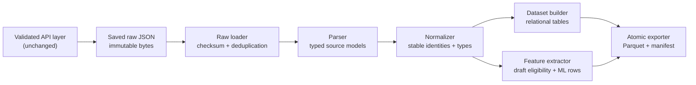

# Milestone 2: Liquipedia Data Pipeline

Status: implemented and validated offline
Schema version: `liquipedia-dota-draft-v1`
Pipeline version: `2.0.0`

## 1. Scope and boundary

This milestone transforms saved responses from the official Liquipedia API into
typed, normalized, machine-learning-ready datasets.

The pipeline deliberately starts at a local JSON file. It does not make network
requests, read the API key, or alter the validated discovery and exact-ID
validation scripts. This creates a hard boundary between:

1. the authenticated, rate-limited API acquisition layer;
2. immutable raw response storage; and
3. repeatable offline processing.

Raw responses are read as bytes, checksummed with SHA-256, and never rewritten.
The checksum is carried into normalized records, exported tables, and the build
manifest.

Machine-learning model implementation is out of scope for this milestone.

## 2. Architecture



Each stage has one responsibility and can be tested independently.

| Module | Responsibility |
| --- | --- |
| `src/liquipedia_pipeline/raw.py` | Load exact source bytes, compute SHA-256, deduplicate identical documents, and apply deterministic input ordering. |
| `src/liquipedia_pipeline/parsing.py` | Decode JSON and JSON-encoded nested containers into immutable source-shaped dataclasses. |
| `src/liquipedia_pipeline/models.py` | Define immutable parsed and normalized domain models. |
| `src/liquipedia_pipeline/normalization.py` | Normalize timestamps, durations, sides, and identity keys without semantic guessing. |
| `src/liquipedia_pipeline/features.py` | Decide draft-game eligibility and create a leakage-aware wide ML row. |
| `src/liquipedia_pipeline/dataset.py` | Create normalized relational tables with stable columns and pandas dtypes. |
| `src/liquipedia_pipeline/export.py` | Write content-addressed Parquet/optional CSV files and a provenance manifest atomically. |
| `src/liquipedia_pipeline/pipeline.py` | Compose the independent stages without adding transformation logic. |
| `scripts/build_liquipedia_dataset.py` | Provide the offline command-line entry point. |

## 3. Internal data model

All inter-stage models are frozen, slotted dataclasses. Tuples are used for
nested collections so parsed and normalized records cannot be mutated in
place.

### Raw model

`RawApiDocument`

| Field | Type | Meaning |
| --- | --- | --- |
| `path` | `Path` | Resolved path to the saved response. |
| `sha256` | `str` | SHA-256 of the exact bytes. |
| `content` | `bytes` | Immutable source content. |

### Parsed source models

The parsed models retain Liquipedia's source semantics:

- `ParsedMatch`: series fields, opponent slots, and game collection.
- `ParsedTeam`: match-time opponent slot and player list.
- `ParsedPlayer`: series roster identity fields.
- `ParsedGame`: game result, side assignments, and explicit draft slots.
- `ParsedDraftValue`: pick/ban kind, team slot, slot number, hero source
  name, and exact JSON path.

The parser recognizes only the field convention confirmed in Milestone 1:

- `match2games[i].extradata.team1hero1` through `team1hero5`
- `match2games[i].extradata.team2hero1` through `team2hero5`
- `match2games[i].extradata.team1ban1` through `team1ban7`
- `match2games[i].extradata.team2ban1` through `team2ban7`
- `match2games[i].extradata.team1side`
- `match2games[i].extradata.team2side`
- `match2games[i].winner`

It does not infer a first-pick team or a global draft sequence from the
per-team slots. Those concepts are absent from the model because the validated
API response does not expose them.

### Normalized domain models

- `NormalizedMatch`
- `NormalizedTeam`
- `NormalizedPlayer`
- `NormalizedGame`
- `NormalizedDraftValue`
- `NormalizedHero`

Normalization is deterministic:

| Source concept | Normalized representation |
| --- | --- |
| Date/time | Timezone-aware UTC `datetime`; Unix timestamp is preferred when present. |
| Duration | Integer seconds; validated `59m52s`, `1h02m03s`, `MM:SS`, or `HH:MM:SS`. Two-part minutes may exceed 59 for long games. |
| Side | `TeamSide.RADIANT`, `TeamSide.DIRE`, or null when absent. Unknown non-null values fail validation. |
| Hero/team/player identity | Unicode-normalized, case-folded, hyphenated key plus original source name. |
| Game identity | `lpdb:{match2id}:game:{match2gameid-or-one-based-index}`. |
| Missing value | `None`; missing information is never filled through inference. |

Identity normalization does not merge aliases. If two distinct observed hero
names collapse to one normalized key, the pipeline fails and requires a future
explicit alias policy.

## 4. Dataset schema

Parquet is the canonical export. Pandas nullable dtypes are used before export:

- text: `string`
- nullable integer: `Int64`
- boolean: `boolean`
- UTC timestamp: `datetime64[us, UTC]`

### `matches`

One row per Liquipedia series.

| Column | Logical type | Nullable |
| --- | --- | --- |
| `schema_version` | string | no |
| `source_document_sha256` | string | no |
| `source_match_id` | string | no |
| `start_time_utc` | UTC timestamp | yes |
| `source_date_text` | string | yes |
| `patch` | string | yes |
| `liquipedia_tier` | string | yes |
| `tournament` | string | yes |
| `parent` | string | yes |
| `series` | string | yes |
| `best_of` | integer | yes |
| `finished` | boolean | no |
| `winner_team_slot` | integer | yes |
| `status` | string | yes |
| `result_type` | string | yes |
| `walkover` | string | yes |

### `match_teams`

One row per series opponent.

| Column | Logical type | Nullable |
| --- | --- | --- |
| `source_match_id` | string | no |
| `team_slot` | integer | no |
| `team_key` | string | yes |
| `source_name` | string | yes |
| `template` | string | yes |
| `score` | integer | yes |
| `status` | string | yes |

### `match_players`

One row per player listed on a series opponent. These are roster identities,
not game-level performance statistics.

| Column | Logical type | Nullable |
| --- | --- | --- |
| `source_match_id` | string | no |
| `team_slot` | integer | no |
| `player_slot` | integer | no |
| `player_key` | string | yes |
| `source_name` | string | yes |
| `display_name` | string | yes |
| `flag` | string | yes |
| `publisher_id` | string | yes |

### `games`

One row per returned game object, including incomplete placeholders.

| Column | Logical type | Nullable |
| --- | --- | --- |
| `schema_version` | string | no |
| `game_key` | string | no |
| `source_document_sha256` | string | no |
| `source_match_id` | string | no |
| `source_game_id` | string | yes |
| `game_index` | integer | no |
| `start_time_utc` | UTC timestamp | yes |
| `source_date_text` | string | yes |
| `patch` | string | yes |
| `duration_seconds` | integer | yes |
| `winner_team_slot` | integer | yes |
| `team1_side` | string enum | yes |
| `team2_side` | string enum | yes |
| `status` | string | yes |
| `result_type` | string | yes |
| `walkover` | string | yes |
| `is_trainable_draft` | boolean | no |
| `exclusion_reason` | string | yes |

A forfeit or walkover with no `match2games` objects remains represented in
`matches`; the pipeline does not invent a game row.

### `heroes`

Observed vocabulary only. This is not claimed to be a complete canonical hero
catalog.

| Column | Logical type | Nullable |
| --- | --- | --- |
| `hero_key` | string | no |
| `source_name` | string | no |

### `draft_picks` and `draft_bans`

Long-form explicit draft slots. Both tables have the same schema.

| Column | Logical type | Nullable |
| --- | --- | --- |
| `game_key` | string | no |
| `source_match_id` | string | no |
| `game_index` | integer | no |
| `team_slot` | integer | no |
| `slot` | integer | no |
| `hero_key` | string | no |
| `hero_source_name` | string | no |
| `source_json_path` | string | no |

The `slot` is the source's per-team hero or ban slot. It is not a global draft
event index.

### `ml_draft_games`

One row per completed game that passes the strict draft eligibility gate. The
stable schema has 64 columns:

| Column group | Columns | Role |
| --- | --- | --- |
| Lineage | `game_key`, `source_match_id`, `source_game_id`, `game_index` | Join/debug metadata; not intended as model features. |
| Pregame context | `match_start_utc`, `patch`, `liquipedia_tier`, `tournament`, `series` | Candidate contextual features. |
| Teams and sides | `team1_key`, `team2_key`, `team1_side`, `team2_side`, `radiant_team_slot`, `dire_team_slot` | Candidate pregame features and deterministic side mapping. |
| Target | `radiant_win` | Supervised target; never an input feature. |
| Per-team picks | `team{1,2}_pick_slot_{1..5}_hero_key` | Source team-slot representation. |
| Side-relative picks | `{radiant,dire}_pick_slot_{1..5}_hero_key` | Radiant/Dire representation. |
| Per-team bans | `team{1,2}_ban_slot_{1..7}_hero_key` | Source team-slot representation. |
| Side-relative bans | `{radiant,dire}_ban_slot_{1..7}_hero_key` | Radiant/Dire representation. |

The repeated draft patterns expand to:

- 20 pick columns: four representations for each of five pick slots;
- 28 ban columns: four representations for each of seven ban slots.

Both team-slot and side-relative views are exported for reuse. A future model
configuration must choose its feature view deliberately rather than feed both
redundant encodings into a model automatically.

Post-game values such as duration, score, and winner slot are excluded from
the ML feature table. A valid normalized duration is required only as a
data-completeness eligibility gate; it is never exported as a model feature.
`radiant_win` is retained only as the target.

## 5. Draft eligibility gate

The first applicable exclusion reason is recorded in a fixed order:

1. `invalid_series_result`
2. `match_not_finished`
3. `invalid_game_result`
4. `missing_game_winner`
5. `missing_or_invalid_sides`
6. `incomplete_team1_picks`
7. `incomplete_team1_bans`
8. `incomplete_team2_picks`
9. `incomplete_team2_bans`
10. `duplicate_picked_hero`
11. `missing_game_duration`

A trainable row therefore requires:

- a normally completed series and game;
- a game winner in source team slot 1 or 2;
- one explicit Radiant and one explicit Dire assignment;
- five explicit picks and seven explicit bans for each team;
- ten distinct picked heroes; and
- a non-missing, successfully normalized game duration.

The gate remains strict. Legacy, incomplete, upcoming, cancelled, defaulted,
and unplayed source shapes are retained in normalized tables but excluded from
`ml_draft_games`. The exact official sentinel `Default` normalizes to null and
is therefore ineligible; it is never replaced with zero or an inferred value.
Other unsupported non-missing duration strings remain normalization errors.
The duration check is last in the fixed reason order, so an earlier existing
failure reason remains authoritative when more than one condition is missing.

## 6. Export and reproducibility

Run the offline pipeline with one or more saved response files:

```bash
python scripts/build_liquipedia_dataset.py \
  --input data/validation/liquipedia/runs/<run-id>/response.json
```

Repeat `--input` to combine bounded responses. Add `--csv` only when a CSV copy
is needed.

Output is content-addressed:

```text
data/processed/liquipedia/
└── build_<fingerprint-prefix>/
    ├── matches.parquet
    ├── match_teams.parquet
    ├── match_players.parquet
    ├── games.parquet
    ├── heroes.parquet
    ├── draft_picks.parquet
    ├── draft_bans.parquet
    ├── ml_draft_games.parquet
    └── manifest.json
```

The build fingerprint hashes:

- the sorted raw source SHA-256 checksums;
- all source files in `src/liquipedia_pipeline`;
- the pipeline version;
- the dataset schema version; and
- the Python, pandas, and DuckDB versions; and
- the requested export formats.

Rows and inputs are sorted with stable rules. Exports are written to a staging
directory and renamed only after every table and manifest has succeeded.
Re-running an identical build reuses the matching complete directory.

`manifest.json` records source checksums, source byte sizes, pipeline checksum,
schema, pipeline and runtime versions, export formats, table row counts,
ordered columns, pandas dtypes, and output file checksums.

## 7. Tests

`tests/test_liquipedia_pipeline.py` uses synthetic source-shaped JSON only. It
does not call the API.

Coverage includes:

- the validated draft naming convention and source JSON paths;
- nested JSON-encoded API containers;
- strict timestamp, duration, side, and identity normalization, including the
  `Default`-to-null sentinel and missing-duration eligibility policy;
- complete, legacy incomplete, upcoming, and forfeit payload shapes;
- leakage-safe ML row construction;
- stable empty-dataset dtypes;
- order-independent duplicate handling and conflict rejection;
- raw byte immutability;
- content-addressed/idempotent exports; and
- DuckDB Parquet round-trip validation.

Run all tests with:

```bash
python -m pytest -q
```

## 8. Deliberate limitations

- First pick and global draft sequence remain unavailable and are never
  inferred from per-team slots.
- The observed API response does not provide a canonical hero identifier in
  these draft fields, so `hero_key` is a stable source-name key, not an
  official numeric hero ID.
- No implicit alias merge is applied to heroes, teams, or players.
- Missing patch values stay null.
- Series roster identities do not establish game-level hero assignments or
  player performance statistics.
- Spatial telemetry needed for true position heatmaps is not present in the
  validated response and is not manufactured by this pipeline.
