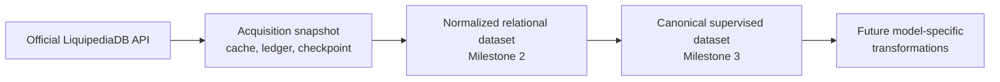

# Milestone 3: Historical Acquisition and Canonical Training Dataset

Status: complete; bounded authenticated pilot and offline lineage validated
Acquisition contract: `liquipedia-history-v1`
Normalized schema: `liquipedia-dota-draft-v1`
Supervised schema: `dota-draft-supervised-v1`

## 1. Architecture and boundaries



The four layers have separate contracts:

1. Acquisition knows HTTP requests and raw response provenance, but not ML
   features.
2. Normalization knows source-field interpretation, but not pagination or model
   experiments.
3. The supervised builder reads only normalized Parquet and never imports the
   API client, raw loader, parser, or normalizer.
4. Future model code must consume the canonical supervised dataset rather than
   bypassing it.

No model training, feature encoding, inference, backend, or frontend is part of
this milestone.

## 2. Implementation map

### Historical acquisition

| Module | Responsibility |
| --- | --- |
| `src/liquipedia_backfill/contract.py` | Approved endpoint, projection, operational rate defaults, and acquisition version. |
| `src/liquipedia_backfill/config.py` | Immutable scope configuration and path-independent configuration hash. |
| `src/liquipedia_backfill/planner.py` | Exact credential-free request sequence and offline JSON/Markdown plans. |
| `src/liquipedia_backfill/client.py` | One-request official API client with gzip and credential redaction. |
| `src/liquipedia_backfill/cache.py` | Immutable successful-page cache keyed by canonical request SHA-256. |
| `src/liquipedia_backfill/state.py` | Transactional SQLite request ledger, pages, run state, rate history, and JSON checkpoints. |
| `src/liquipedia_backfill/runner.py` | Cache-first traversal, persistent rate enforcement, hard request budget, and failure preservation. |
| `src/liquipedia_backfill/assembly.py` | Match/game deduplication, conflict quarantine, accepted snapshot, and provenance indices. |
| `src/liquipedia_backfill/finalize.py` | Offline handoff into the unchanged Milestone 2 pipeline. |
| `src/liquipedia_backfill/reports.py` | Coverage and eligibility reports from normalized Parquet. |
| `scripts/backfill_liquipedia_history.py` | Safe-default plan, explicit live execution, and offline finalization CLI. |

### Canonical supervised dataset

| Module | Responsibility |
| --- | --- |
| `src/draft_training_dataset/schema.py` | Stable schema, roles, feature columns, target, nullability, and forbidden leakage columns. |
| `src/draft_training_dataset/builder.py` | Checksum-verified normalized input loading, side-relative row construction, filtering, export, and fingerprinting. |
| `scripts/build_draft_training_dataset.py` | Independent offline supervised-dataset CLI. |

The existing validation and `src/liquipedia_pipeline` packages were not
modified for Milestone 3.

## 3. Executed pilot request

The pilot is a single bounded partition:

| Setting | Value |
| --- | --- |
| Endpoint | `GET https://api.liquipedia.net/api/v3/match` |
| Start | `2026-07-01T00:00:00Z` |
| End | `2026-07-27T00:00:00Z`, exclusive |
| Tiers | `1`, `2` |
| Completion | `finished=1` |
| Page size | `100` |
| Ordering | `date ASC, match2id ASC` |
| Expected requests | 1–2 |
| Hard maximum | 4 |
| Automatic retries | 0 |
| Operational hourly ceiling | 54 |
| Minimum request interval | 67 seconds |

Conditions:

```text
([[liquipediatier::1]] OR [[liquipediatier::2]])
AND [[finished::1]]
AND [[date::>2026-06-30 23:59:59]]
AND [[date::<2026-07-27 00:00:00]]
```

The possible offsets are `0`, `100`, `200`, and `300`. The next page is
requested only when the previous page has exactly 100 records. A shorter page
completes the partition; a full fourth page stops as `budget_exhausted`.

The approved pilot completed in two HTTP attempts: the first page returned 100
matches and the terminal second page returned 8. It produced 108 normalized
matches, 261 normalized games, and 232 eligible supervised games. Both raw
responses remain in the immutable checksum-verified cache.

Patch filters are recorded in configuration but applied after normalization.
No nested or top-level patch restriction is added to the API request because
that could omit games whose usable patch exists at a different level.

## 4. Safe operating interface

Offline planning is the default:

```bash
python scripts/backfill_liquipedia_history.py
```

This command does not read the API key, open a network connection, or create a
request ledger entry.

Live execution requires both flags:

```bash
python scripts/backfill_liquipedia_history.py \
  --execute \
  --confirm-live-request-budget 4
```

The confirmation value must exactly equal `--max-requests`. The key is read
only in live mode from `LIQUIPEDIA_API_KEY` or the ignored
`.secrets/liquipedia_api_key` file. It is sent only in the `Authorization`
header.

Offline finalization of a completed acquisition is separate:

```bash
python scripts/backfill_liquipedia_history.py --finalize
```

## 5. Cache, checkpoint, and exact request accounting

The global cache layout is:

```text
data/raw/liquipedia/backfill/
├── state.sqlite3
└── cache/
    └── <request-sha256>/
        ├── response.json
        └── metadata.json
```

The request hash covers method, endpoint, wiki, conditions, projection,
ordering, stream flags, limit, and offset. It excludes authentication.

Successful response metadata contains:

- request and response hashes;
- credential-free URL and parameters;
- HTTP status and safe content headers;
- acquisition timestamp;
- byte and record counts; and
- cache validation state.

The runner verifies cached bytes against metadata before reuse. A successful
page is never overwritten by different bytes.

SQLite records an attempt as `started` before network I/O, ensuring a process
failure cannot erase request consumption. It then records success, HTTP error,
or invalid response. The rolling-hour limiter considers attempts across every
run sharing the state file.

The human checkpoint contains:

- immutable configuration and hash;
- status and next sequence/offset;
- exact network request and cache-hit counts;
- accepted pages and raw hashes;
- the complete request ledger.

Checkpoint advancement happens only after a successful response is cached and
the SQLite transaction commits.

## 6. Failure behavior

| Condition | Behavior |
| --- | --- |
| Successful cached page | Reuse locally; request count does not increase. |
| `403` or another HTTP error | Record exact redacted error, checkpoint `failed`, and stop. |
| `429` | Record status and `Retry-After`, checkpoint, and stop without hidden retry. |
| Invalid JSON or response envelope | Preserve bytes under `failed_responses`, do not cache as successful, and stop. |
| API-level `error` value | Treat as an invalid response; do not advance offset. |
| Full final approved page | Checkpoint `budget_exhausted`; do not exceed budget. |
| Process interruption | Resume from SQLite and verified cache. |

All attempts, including failures, count against the configured request budget.

## 7. Deduplication and assembly

### Match identity

The stable source identity is `match2id`.

- The record payload hash is calculated after recursively decoding
  JSON-encoded containers and canonicalizing JSON keys.
- Identical IDs and payload hashes are exact duplicates and collapse to one
  record.
- Identical IDs with different payload hashes are preserved in raw pages,
  reported as `conflicting_match_versions`, and excluded from the accepted
  snapshot.
- Records without `match2id` are quarantined.

### Game identity

The preferred identity is `(match2id, match2gameid)`.

- Exact repeated game IDs and payload hashes collapse to one derived snapshot
  game.
- Conflicting payloads for the same game ID quarantine the parent match.
- A missing game ID remains null. The assembly index uses match ID, source
  game index, and payload hash only as an internal lineage key.

The assembly snapshot is derived data, not a replacement for cached responses.
Its manifest maps accepted records and games back to raw response hashes.

## 8. Normalized data and coverage reports

A completed assembly snapshot is passed to the existing
`run_pipeline(...)` entry point. The resulting Parquet tables and Milestone 2
manifest are unchanged.

Coverage reports include:

- `coverage_by_year.parquet`
- `coverage_by_patch.parquet`
- `coverage_by_tier.parquet`
- `coverage_by_tournament.parquet`
- `eligibility_failures.parquet`
- `coverage_summary.json`
- `coverage_summary.md`

Metrics include match and game counts, matches without game objects, known
winners, valid sides, complete pick and ban sets, patch coverage, trainable
games, and every deterministic eligibility failure.

## 9. Canonical supervised schema

`draft_training_games.parquet` has one row per normalized game with
`is_trainable_draft=true`. That normalized eligibility flag now requires a
valid, non-missing duration in addition to the existing result, side, draft,
and duplicate-hero checks. The exact Liquipedia sentinel `Default` remains
null and is ineligible; no duration is inferred or replaced with zero.

Duration is used only to reject incomplete source records. It remains
post-game information and is explicitly forbidden from the supervised feature
schema.

### Identity, grouping, and time

```text
sample_id
game_key
source_game_id
game_index
source_match_id
match_start_utc
```

`sample_id` equals the stable normalized `game_key`. `source_match_id` is
explicitly a grouping identifier so future temporal splits can keep games from
the same series together.

### Pregame context

```text
patch
liquipedia_tier
tournament
series
radiant_team_key
dire_team_key
```

These are marked `context_feature`. A future model configuration must still
choose its inputs explicitly.

### Side-relative draft features

```text
radiant_pick_slot_1 ... radiant_pick_slot_5
dire_pick_slot_1 ... dire_pick_slot_5
radiant_ban_slot_1 ... radiant_ban_slot_7
dire_ban_slot_1 ... dire_ban_slot_7
```

No `team1`/`team2` duplicate representation is exported. Slots preserve
per-team order only.

### Target

```text
radiant_win
```

It is derived only by mapping the explicit normalized winner team slot through
the explicit Radiant/Dire assignments.

### Explicitly forbidden

```text
duration_seconds
winner_team_slot
score
walkover
result_type
status
first_pick
first_pick_team_slot
global_draft_order
global_draft_sequence
```

The supervised builder validates that no forbidden column is exported. It
also rejects a stale normalized input that marks a game trainable while
`duration_seconds` is missing, forcing the normalized dataset to be rebuilt
under the current eligibility contract.

## 10. Supervised artifacts and reproducibility

```text
data/training/dota_draft_supervised/
└── build_<fingerprint>/
    ├── draft_training_games.parquet
    ├── excluded_games.parquet
    ├── hero_vocabulary.parquet
    ├── schema.json
    ├── manifest.json
    ├── quality_report.json
    └── data_card.md
```

The builder first verifies normalized Parquet checksums from the normalized
manifest. Its fingerprint includes:

- normalized build fingerprint;
- supervised schema and builder versions;
- complete supervised package source hash;
- filters;
- ordered sample IDs; and
- Python, pandas, and DuckDB versions.

The manifest records all input and output hashes, row counts, filters, schema,
class balance, null counts, time range, exclusions, and Liquipedia attribution.

`excluded_games.parquet` contains scoped non-trainable games with reason,
observed pick/ban counts, and winner/side availability. It is an audit artifact
and is never mixed with training rows.

## 11. Temporal policy

No train, validation, or test split is created in Milestone 3. The canonical
dataset preserves event time and series grouping so the future model milestone
can create versioned chronological split manifests without rebuilding source
rows.

## 12. Offline verification

`tests/test_milestone3_backfill.py` covers:

- exact bounded and credential-free request planning;
- minimum spacing and persistent request accounting;
- checkpoint/resume behavior;
- successful cache reuse with zero requests;
- hard request-budget exhaustion;
- cache corruption detection;
- invalid-response preservation without successful caching;
- match and game deduplication;
- conflicting version quarantine;
- complete offline handoff through Milestone 2;
- side-relative supervised row and target correctness;
- explicit schema roles and leakage exclusions;
- missing-duration exclusion and stale normalized-input rejection;
- normalized input checksum validation;
- deterministic supervised filters and build reuse; and
- static proof that the supervised package imports no upstream acquisition,
  parsing, or normalization package.

## 13. Completion and next boundary

Milestone 3 is complete. The bounded pilot, raw cache and request ledger,
assembly, unchanged Milestone 2 normalization, coverage reports,
`dota-draft-supervised-v1` build, fingerprint lineage, and full offline suite
were validated.

The next acquisition work is Milestone 3.5. Its historical expansion remains
independently gated; completing this pilot did not authorize any broader
request window.
